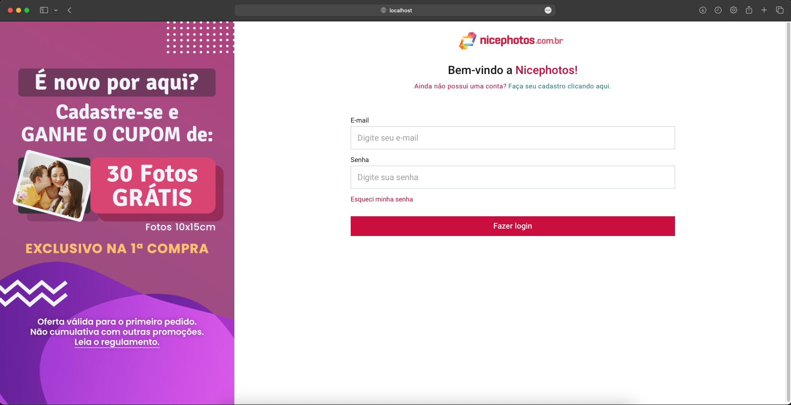

   

# Nicephotos Teste técnico (Reactjs + Node.js)

## Principais ferramentas utilizadas

- Typescript;
- Node.js;
- Express;
- Prisma ORM
- Reactjs;
- Sass;
- React-hook-form
- React-toastfy

## Setup

- Clone o repositório;
- Entre na pasta front e back, e instale as dependencias de cada uma (`npm install`);
- No back-end crie um arquivo .env e coloque (DATABASE_URL="file:./dev.db");
- Rode o front e back (`npm run dev`);
- Portas setadas pra localhost:5173 (front) e localhost:3333 (back).

 
 

## Prints do projeto

   
    
   
    
   
    
   

